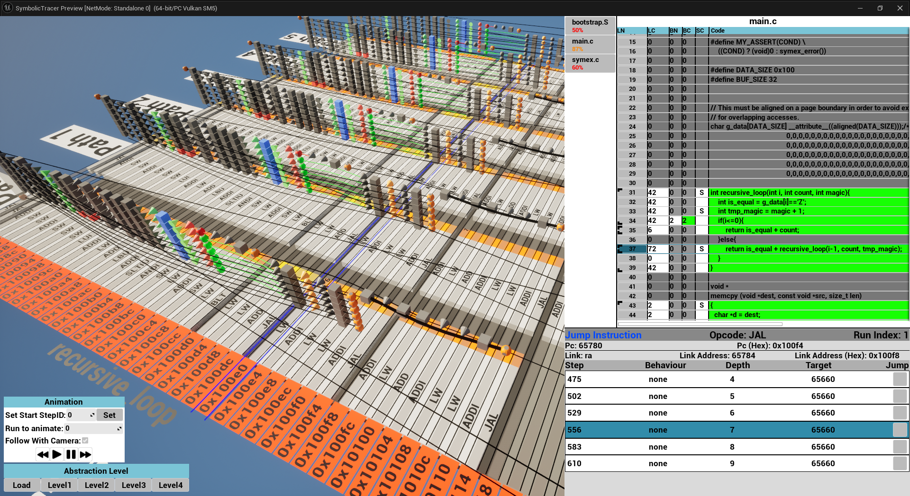

# SymbolicTracerUnrealEngine

This [Unreal Engine](https://www.unrealengine.com/en-US) application visualizes symbolic execution traces in 3D space with HUD elements. 
The traces are generated by [this](https://github.com/agra-uni-bremen/symex-trace-vp) RISC-V Virtual Prototype.





## About 

Symbolic execution is used to automatically explore and test software, to find bugs and potential vulnerabilities.
The problem is, that the execution can be difficult to understand.
Thus different visualizations have been developed, to ease this process.

This project visualizes the symbolic execution traces of RISC-V programs in 3 dimensions, with additional HUD elements.

An example video can be seen here: [YouTube](https://www.youtube.com/watch?v=PjYUz7UHizg)

This visualization tool consists of two parts:
- a Python program, that processes the raw analysis trace files into a PTrace and Blk JSON file (inside trace-processing folder)
- the Unreal Engine application, that visualizes the processed trace files, as well as the source code files (inside SymbolicTracer folder)

## Installation

### Python module
The module requires Python version 3.1 or newer to be installed

### Unreal Engine visualization
To simply use the tool, the prebuild binaries can be found in the <strong>build</strong> folder for Linux and Windows. After extraction:

- Linux: execute /build/Linux/SymbolicTracer/Binaries/Linux/SymbolicTracer-Linux-Shipping
- Windows: execute /build/Windows/SymbolicTracer/Binaries/Win64/SymbolicTracer-Win64-Shipping

To change and further develop the application the Unreal Engine has to be installed.
Then the project can be used, like any other Unreal Engine C++ project.
Unreal Engine version 5.3.2 was used, to create this tool.

## Usage 
To create the .ptrace and the .blk files, needed for the visualization, run the `convert_raw_trace.py` Python script.

script usage: 
```powershell
convert_raw_trace.py [-h] --trace TRACE --output OUTPUT --elf ELF --source SOURCE
```
or in other words:
```powershell
python ./convert_raw_trace.py --trace "complete/path/to/out.rtrace" --output "choose/some/outputDir" --elf "complete/path/to/compiled/elfFile" --source "complete/path/to/main/sourceFile"
```

After this process is finished, the visualization can be started. With the load button at the left bottom corner, an input window opens. There the whole file path to the folder, containing the ptrace, blk, source code files and elf binary needs to be entered and confirmed with the enter key. Afterward, click on ok.
Depending on the trace size you might need to wait a few seconds.
The scene can be navigated with the w, a, s, d keys, as well as the mouse. To rotate or change the camera angle you can either press and hold the mouse wheel and move the mouse, or use the q and e keys.
The HUD views can be switched by pressing the v key.


## Usage Example:

Some example data is already located in the exampleData folder.
There are 3 different programs varying in size, which can be loaded via the visualization.
You just need to specify the complete path, to one of the examples, when visualizing the trace, as explained in the previous section.
The linked YouTube video from the beginning also shows, how the visualization loads the trace data.

